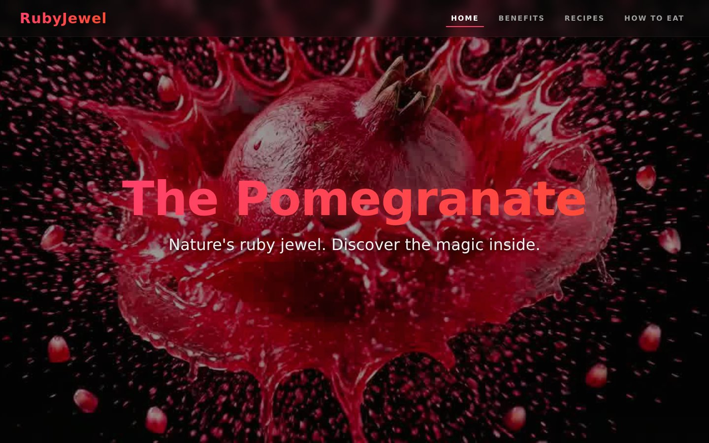
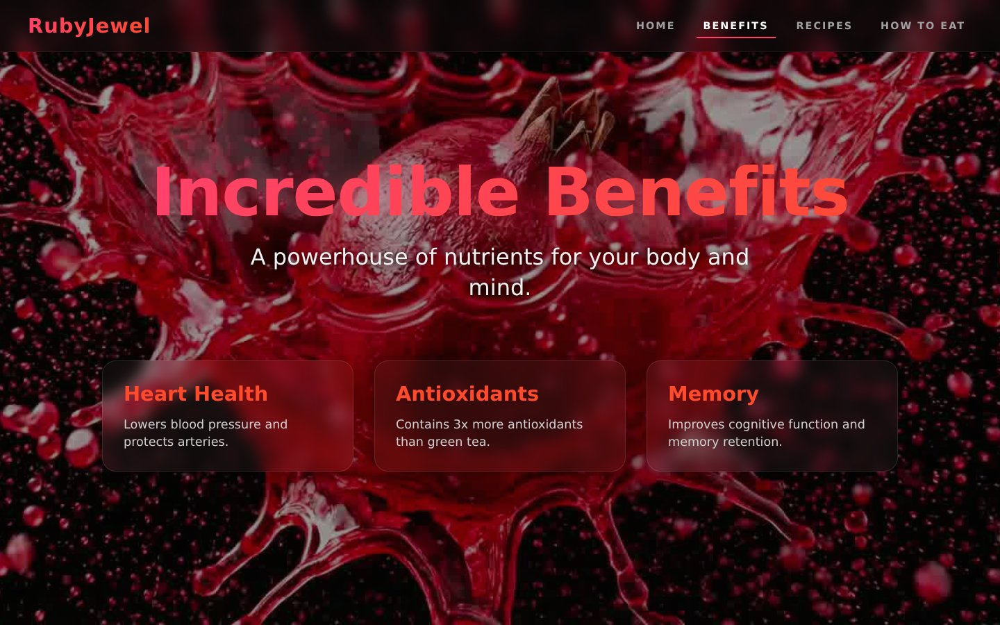
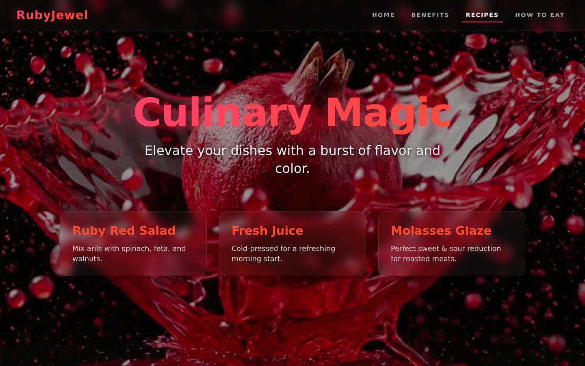
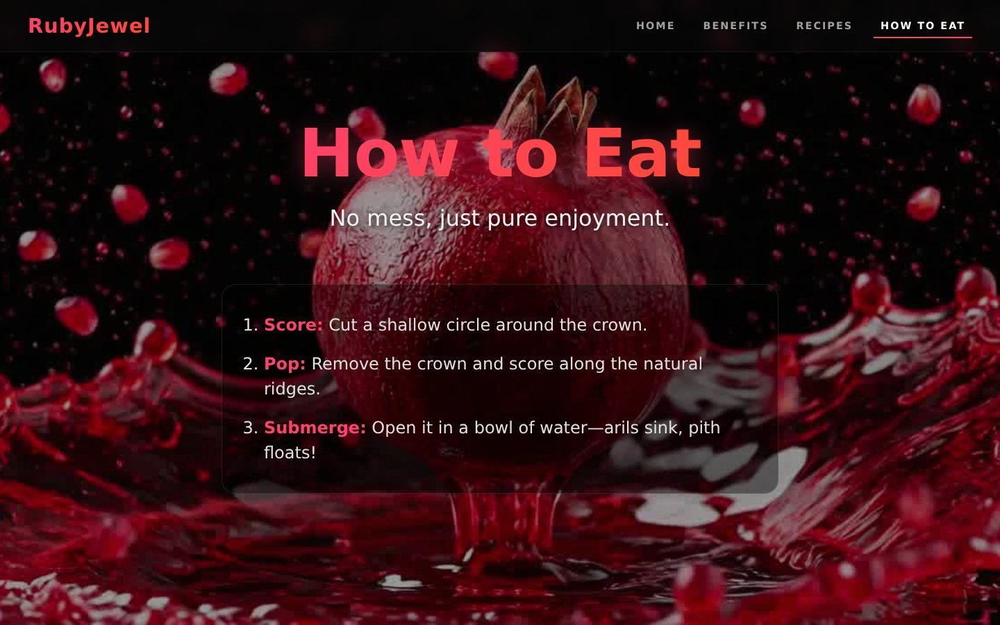
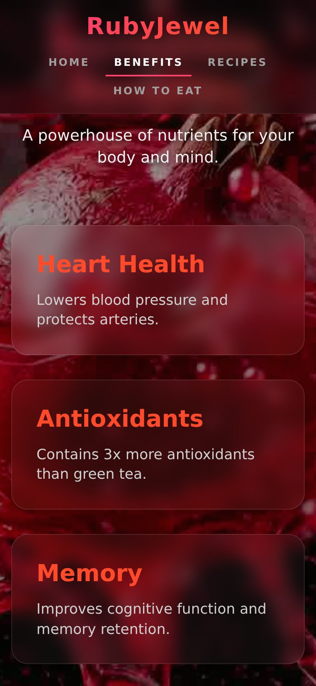

# 🍎 Pomegranate — Scroll-Driven Storytelling Website


An immersive, scroll-driven single-page experience all about the pomegranate — built with **React** and **Vite**. As you scroll, 212 pre-rendered frames play seamlessly on a `<canvas>` (like an Apple-style product page), while glass-morphism content sections guide you through the fruit's benefits, recipes, and the best way to eat it.

<p align="center">
  
</p>

---

## ✨ Features

- **Scroll-driven frame animation** — 212 image frames rendered on an HTML5 Canvas, scrubbed in real time as you scroll
- **Glass-morphism UI** — frosted-glass navbar and cards with backdrop blur
- **Smooth section navigation** — fixed navbar with active-section tracking and smooth scrolling
- **Rich content sections** — Home, Health Benefits, Recipes, and a step-by-step "How to Eat" guide
- **Fully responsive** — fluid typography and layout that adapts from desktop to mobile
- **Fast & lightweight** — no heavy animation libraries, just React + the Canvas 2D API
- **Smart preloading** — frames are preloaded up-front so playback stays buttery smooth

---

## 📸 Preview

| Benefits | Recipes |
|:---:|:---:|
|  |  |

| How to Eat | Mobile View |
|:---:|:---:|
|  |  |

---

## 🛠 Tech Stack

| Technology | Role |
|---|---|
| [React 18](https://react.dev/) | UI library (components, hooks) |
| [Vite 5](https://vitejs.dev/) | Build tool & dev server |
| HTML5 Canvas | Scroll-driven frame rendering |
| CSS3 | Glass-morphism, gradients, responsive layout |
| [Google Fonts — Outfit](https://fonts.google.com/specimen/Outfit) | Typography |

---

## 📋 Prerequisites

Before you begin, make sure you have the following installed:

- **Node.js** ≥ 18 ([Download](https://nodejs.org/))
- **npm** ≥ 9 (ships with Node.js)
- **Git** ([Download](https://git-scm.com/))

Verify your versions:

```bash
node -v
npm -v
```

---

## 🚀 Installation

**1. Clone the repository**

```bash
git clone https://github.com/Murli-B/Pomegranate-website.git
```

**2. Navigate into the project folder**

```bash
cd Pomegranate-website
```

**3. Install the dependencies**

```bash
npm install
```

**4. Start the development server**

```bash
npm run dev
```

**5. Open the app 🎉**

Visit **http://localhost:5173** in your browser — the site hot-reloads automatically as you edit the code.

---

## 📦 Available Scripts

| Command | Description |
|---|---|
| `npm run dev` | Start the Vite dev server (http://localhost:5173) |
| `npm run build` | Create an optimized production build in `dist/` |
| `npm run preview` | Locally preview the production build |

### Production build

```bash
npm run build
npm run preview
```

The static files generated in `dist/` can be deployed to any static host (Netlify, Vercel, GitHub Pages, Firebase Hosting, an nginx server, …).

---

## 📁 Project Structure

```
Pomegranate-website/
├── index.html              # App entry HTML
├── package.json            # Dependencies & scripts
├── vite.config.js          # Vite configuration
├── public/
│   └── jpg/                # 212 animation frames (ezgif-frame-001.jpg … ezgif-frame-212.jpg)
├── docs/
│   └── images/             # README screenshots
└── src/
    ├── main.jsx            # React entry point
    ├── App.jsx             # Main component — canvas animation + content sections
    └── index.css           # Global styles (glass-morphism, layout, responsive rules)
```

---

## ⚙️ How the Scroll Animation Works

1. On load, all **212 frames** (`public/jpg/ezgif-frame-XXX.jpg`) are preloaded into memory.
2. The canvas is placed in a **sticky full-screen container** behind the content.
3. As the visitor scrolls, the app computes the **scroll fraction** (0 → 1) and maps it to a frame index.
4. The matching frame is drawn on the canvas with `drawImage()`, producing a smooth, video-like animation driven entirely by scrolling.
5. The navbar highlights the current section as it comes into view.

---

## 🎨 Customization

| Want to change… | Do this |
|---|---|
| Animation frames | Replace the images in `public/jpg/` (keep the `ezgif-frame-XXX.jpg` naming) and update `FRAME_COUNT` in `src/App.jsx` |
| Colors / gradients | Edit `src/index.css` (accent gradient: `#ff416c → #ff4b2b`) |
| Text & sections | Edit the JSX in `src/App.jsx` (`home`, `benefits`, `recipes`, `how-to-eat`) |
| Font | Change the `@import` at the top of `src/index.css` |
| Scroll length | Adjust `.content { height: 800vh }` in `src/index.css` |

---

## 🤝 Contributing

Contributions are welcome! Feel free to **open an issue** or submit a **pull request** with improvements.

1. Fork the repository
2. Create your feature branch: `git checkout -b feature/amazing-feature`
3. Commit your changes: `git commit -m "Add amazing feature"`
4. Push to the branch: `git push origin feature/amazing-feature`
5. Open a pull request

---

<p align="center">Made with ❤️ and lots of pomegranate juice.</p>
